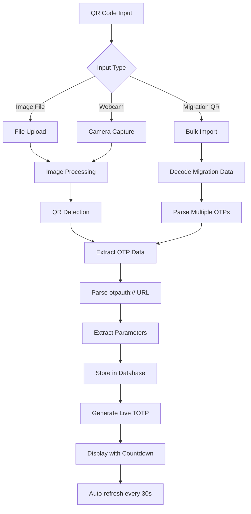

# Authentoire

A comprehensive local-only TOTP (Time-based One-Time Password) code generator and management system developed by Smartoire. Extract, manage, and generate 2FA codes from Google Authenticator and other OTP providers.

## 🌟 Features

### 🔐 Core Functionality
- **QR Code Extraction**: Decode QR codes from Google Authenticator exports
- **Multiple Interfaces**: Web UI, CLI tools, and API endpoints
- **Real-time Generation**: Live TOTP codes with countdown timers
- **Database Storage**: Persistent storage of OTP entries
- **Session Security**: PIN-based authentication with configurable timeouts

### 📱 QR Code Processing
- **Google Authenticator Support**: Extract from export QR codes
- **Migration QR Codes**: Handle bulk OTP imports
- **Multiple Detection Methods**: OpenCV, QReader, and fallback options
- **Webcam Scanning**: Direct camera QR code capture
- **File Upload**: Traditional image file processing

### 🛠️ Multiple Implementations
- **Python Flask Web App**: Full-featured web interface
- **Rust Actix Server**: High-performance backend
- **Python CLI**: Command-line interface with interactive mode
- **REST API**: Programmatic access to OTP functionality

## 📋 Project Structure

```
Authentoire/
├── settings.toml                 # Global configuration
├── requirements.txt              # Python dependencies
├── README.md                     # This file
├── generate_key.py              # Encryption key generator
├── settings.toml.sample         # Configuration template
│
├── python-flask/                 # Flask web application
│   ├── wsgi.py                  # Flask application entry
│   ├── routes/                  # API routes
│   │   ├── auth.py              # Authentication
│   │   ├── dashboard.py         # Main dashboard
│   │   ├── code.py              # OTP management
│   │   └── webcam.py            # QR scanning
│   ├── models/                  # Database models
│   ├── templates/               # HTML templates
│   ├── static/                  # CSS/JS assets
│   └── migrations/              # Database migrations
│
├── python-cli/                   # Command-line interface
│   ├── authentoire.py           # Main CLI tool
│   └── README.md                 # CLI documentation
│
├── rust-actix/                   # Rust web server
│   ├── src/
│   │   ├── main.rs              # Rust application entry
│   │   ├── settings.rs          # Configuration
│   │   └── qr.rs                # QR processing
│   └── Cargo.toml               # Rust dependencies
│
└── certs/                        # SSL certificates
    ├── gpu.pem
    └── gpu-key.pem
```

## 🚀 Quick Start

### Installation

1. **Clone the repository**:
   ```bash
   git clone <repository-url>
   cd Authentoire
   ```

2. **Install Python dependencies**:
   ```bash
   pip install -r requirements.txt
   ```

3. **Configure settings**:
   ```bash
   cp settings.toml.sample settings.toml
   # Edit settings.toml with your preferences
   ```

4. **Initialize database** (Flask version):
   ```bash
   cd python-flask
   flask db upgrade
   python wsgi.py
   ```

### Usage Options

#### 🌐 Web Interface (Flask)
```bash
cd python-flask
python wsgi.py
# Access at https://127.0.0.1:8443
```

#### ⌨️ Command Line Interface
```bash
# Basic QR decoding
python python-cli/authentoire.py qr_code.png

# Interactive mode with live TOTP generation
python python-cli/authentoire.py --interactive qr_codes.png

# Test mode
python python-cli/authentoire.py --test
```

#### 🦀 High-Performance Server (Rust)
```bash
cd rust-actix
cargo run
# Access at http://0.0.0.0:8080
```

## 📱 Google Authenticator QR Code Extraction

### Supported QR Code Types

#### 1. **Individual OTP QR Codes**
```
otpauth://totp/ServiceName:user@example.com?secret=JBSWY3DPEHPK3PXP&issuer=ServiceName&algorithm=SHA1&digits=6
```

#### 2. **Migration QR Codes** (Bulk Export)
```
otpauth-migration://offline?data=eyJkYXRhIjpbeyJlbWFpbCI6InVzZXJAZXhhbXBsZS5jb20i...
```

### � Original otpauth:// Format

The standard otpauth:// URI format is well-documented and widely supported by TOTP applications. This format represents individual OTP tokens that can be shared via QR codes or direct links.

#### **Basic Format Structure**
```
otpauth://totp/Issuer:Username?secret=BASE32_SECRET&issuer=Issuer
```

#### **Complete Format with All Parameters**
```
otpauth://totp/Issuer:Username?secret=BASE32_SECRET&issuer=Issuer&algorithm=SHA1&digits=6&period=30
```

#### **URL Components**
- **Scheme**: `otpauth` - Identifies this as an OTP URI
- **Type**: `totp` - Time-based OTP (can also be `hotp` for HMAC-based OTP)
- **Label**: `Issuer:Username` - Human-readable identifier
- **Parameters**: Query string with OTP configuration

#### **Parameters Breakdown**

| Parameter | Required | Description | Example |
|-----------|----------|-------------|---------|
| `secret` | Yes | Base32 encoded secret key | `JBSWY3DPEHPK3PXP` |
| `issuer` | Recommended | Service provider name | `Google` |
| `algorithm` | Optional | Hash algorithm (SHA1, SHA256, SHA512) | `SHA1` |
| `digits` | Optional | Code length (6, 8) | `6` |
| `period` | Optional | Time step in seconds (default: 30) | `30` |

#### **Example 1: Basic TOTP Provisioning**
Provision a TOTP key for user alice@google.com, to use with a service provided by Example, Inc:

```
otpauth://totp/Example:alice@google.com?secret=JBSWY3DPEHPK3PXP&issuer=Example
```

This Base32 encoded key "JBSWY3DPEHPK3PXP" has the value:
```python
# The secret "JBSWY3DPEHPK3PXP" decodes to:
byte[] key = { 'H', 'e', 'l', 'l', 'o', '!', (byte) 0xDE, (byte) 0xAD, (byte) 0xBE, (byte) 0xEF };
```

#### **Example 2: Full Parameters**
Here's another example with all optional parameters supplied:

```
otpauth://totp/ACME%20Co:john.doe@email.com?secret=HXDMVJECJJWSRB3HWIZR4IFUGFTMXBOZ&issuer=ACME%20Co&algorithm=SHA1&digits=6&period=30
```

**URL Decoded Components:**
- **Label**: `ACME Co:john.doe@email.com`
- **Secret**: `HXDMVJECJJWSRB3HWIZR4IFUGFTMXBOZ`
- **Issuer**: `ACME Co`
- **Algorithm**: `SHA1`
- **Digits**: `6`
- **Period**: `30` seconds

#### **Implementation Example**
```python
import pyotp
import urllib.parse

def parse_otpauth_url(otpauth_url):
    """Parse an otpauth:// URL into components"""
    parsed = urllib.parse.urlparse(otpauth_url)
    
    # Extract type (totp/hotp)
    otp_type = parsed.netloc
    
    # Extract label (Issuer:Username)
    label = parsed.path.lstrip('/')
    if ':' in label:
        issuer, name = label.split(':', 1)
    else:
        issuer = name = label
    
    # Parse query parameters
    params = urllib.parse.parse_qs(parsed.query)
    secret = params.get('secret', [''])[0]
    algorithm = params.get('algorithm', ['SHA1'])[0]
    digits = int(params.get('digits', ['6'])[0])
    period = int(params.get('period', ['30'])[0])
    issuer_param = params.get('issuer', [''])[0]
    
    # Use issuer from parameter if available, otherwise from label
    final_issuer = issuer_param if issuer_param else issuer
    
    return {
        'type': otp_type,
        'name': name,
        'issuer': final_issuer,
        'secret': secret,
        'algorithm': algorithm,
        'digits': digits,
        'period': period
    }

# Example usage
url = "otpauth://totp/Example:alice@google.com?secret=JBSWY3DPEHPK3PXP&issuer=Example"
otp_data = parse_otpauth_url(url)

# Generate TOTP
totp = pyotp.TOTP(otp_data['secret'])
current_code = totp.now()
```

#### **Key Technical Details**

##### **Secret Encoding**
- **Format**: Base32 encoding (RFC 4648)
- **Characters**: A-Z, 2-7 (case insensitive)
- **Padding**: Optional '=' characters
- **Purpose**: Easy transcription and QR code encoding

##### **URL Encoding**
- **Spaces**: `%20` (or `+` in some implementations)
- **Special chars**: Percent-encoded per RFC 3986
- **Colons**: Used as separators in label
- **Example**: `ACME%20Co` → `ACME Co`

##### **Algorithm Support**
- **SHA1**: Default, most widely supported
- **SHA256**: More secure, newer standard
- **SHA512**: Highest security, limited support
- **Compatibility**: Not all apps support all algorithms

##### **Time Period**
- **Standard**: 30 seconds (RFC 6238)
- **Variations**: Some services use 60 seconds
- **Synchronization**: Must match server configuration
- **Grace Period**: Usually ±1 window for clock drift

#### **QR Code Generation**
```python
import qrcode

def generate_otp_qr(otpauth_url):
    """Generate QR code for otpauth:// URL"""
    qr = qrcode.QRCode(
        version=1,
        error_correction=qrcode.constants.ERROR_CORRECT_L,
        box_size=10,
        border=4,
    )
    qr.add_data(otpauth_url)
    qr.make(fit=True)
    
    # Create image or ASCII representation
    img = qr.make_image()
    return img

# Generate QR for the example
qr_image = generate_otp_qr(
    "otpauth://totp/Example:alice@google.com?secret=JBSWY3DPEHPK3PXP&issuer=Example"
)
```

#### **Security Considerations**
- **Secret Protection**: Never expose secrets in logs or URLs
- **HTTPS Required**: For transmission over networks
- **QR Code Security**: Physical security of printed QR codes
- **Backup Strategy**: Secure backup of secret keys

#### **Compatibility Notes**
- **Google Authenticator**: Full support for standard format
- **Authy**: Supports extended parameters
- **Microsoft Authenticator**: Basic format support
- **1Password**: Full parameter support
- **LastPass**: Standard format compatibility

### � Google Authenticator Migration QR Algorithm

We recently added support for scanning the new Google Authenticator export QR codes. The single token URI format is well-documented, but the format of the QR codes displayed in the new export feature of Google Authenticator is not. It's not immediately obvious how the format works without doing some reverse engineering.

#### **QR Code Format**
The QR codes contain a URI with the following format:
```
otpauth-migration://offline?data=...
```

- **Scheme**: `otpauth-migration`
- **Host**: `offline`
- **Data Parameter**: Base64 encoded Protobuf message

#### **Protobuf Message Structure**
The data parameter is a base64 encoded Protobuf message with the following format:

```protobuf
syntax = "proto3";

package migration;

message MigrationPayload {
  repeated OtpParameters otp_parameters = 1;
  int32 version = 2;
  int32 batch_size = 3;
  int32 batch_index = 4;
  int32 batch_id = 5;
}

message OtpParameters {
  bytes secret = 1;
  string name = 2;
  string issuer = 3;
  Algorithm algorithm = 4;
  int32 digits = 5;
  OtpType type = 6;
  int64 counter = 7;
}

enum Algorithm {
  ALGO_INVALID = 0;
  ALGO_SHA1 = 1;
  ALGO_SHA256 = 2;
  ALGO_SHA512 = 3;
  ALGO_MD5 = 4;
}

enum OtpType {
  OTP_INVALID = 0;
  OTP_HOTP = 1;
  OTP_TOTP = 2;
}
```

#### **Parsing Process**
1. **Extract Data Parameter**: Parse the `data` query parameter from the migration URL
2. **URL Decode**: Unquote the base64 encoded string
3. **Base64 Decode**: Convert to raw protobuf bytes
4. **Protobuf Parsing**: Parse using the MigrationPayload schema
5. **Extract OTP Parameters**: Iterate through repeated OtpParameters messages
6. **Convert Fields**: Map enums to strings and bytes to Base32

#### **Implementation Example**
```python
import base64
import urllib.parse
import migration_pb2

def parse_migration_qr(qr_data):
    # Extract and decode data parameter
    data = qr_data.split("data=")[1]
    parsed = urllib.parse.unquote(data)
    decoded_data = base64.b64decode(parsed)
    
    # Parse protobuf message
    migration = migration_pb2.MigrationPayload()
    migration.ParseFromString(decoded_data)
    
    # Convert to our format
    otp_entries = []
    for param in migration.otp_parameters:
        # Convert bytes secret to base32 string
        secret_b32 = base64.b32encode(param.secret).decode('utf-8')
        
        # Map algorithm enum to string
        algorithm_map = {
            0: 'ALGO_INVALID',
            1: 'ALGO_SHA1',
            2: 'ALGO_SHA256', 
            3: 'ALGO_SHA512',
            4: 'ALGO_MD5'
        }
        algorithm_str = algorithm_map.get(param.algorithm, 'ALGO_SHA1').replace('ALGO_', '')
        
        # Map type enum to string
        type_map = {
            0: 'OTP_INVALID',
            1: 'OTP_HOTP',
            2: 'OTP_TOTP'
        }
        otp_type_str = type_map.get(param.type, 'OTP_TOTP').replace('OTP_', '')
        
        otp_entries.append({
            'name': param.name,
            'issuer': param.issuer if param.issuer else param.name,
            'secret': secret_b32,
            'algorithm': algorithm_str,
            'digits': param.digits if param.digits > 0 else 6,
            'type': otp_type_str
        })
    
    return otp_entries
```

#### **Key Technical Details**
- **Batch Support**: Migration QRs can contain multiple batches for large exports
- **Version Control**: Protobuf includes version information for compatibility
- **Enum Mapping**: Algorithm and type enums must be mapped to string representations
- **Secret Encoding**: Binary secrets are Base32 encoded for TOTP compatibility
- **Fallback Handling**: Missing issuers default to the name field

#### **Example Migration Data**
A typical migration QR contains data like:
```
otpauth-migration://offline?data=CkEKFF1842ShlDeR98b/FsrO93CFiFsGEhx2Z2hhZmFycG91ckBzdXJnZWZvcndhcmQuY29tGgVTbGFjayABKAEwAgotChQ0R2fLjoxk3R/MmMUeFnnzuY6WSBIFVmFIaVgaCEZhY2Vib29rIAEoATACCjQKFKAaMBgmvgJNAFujqQoPoDhb4e31Egt2Z2hhZmFycG91choJQml0YnVja2V0IAEoATACCkIKFPU8ytT8mDuINKCzgA0Zk1xbIPOtEhx2Z2hhZmFycG91ckBzdXJnZWZvcndhcmQuY29tGgZHb29nbGUgASgBMAIKRQoUSHtESmVxUSFAcFdeLFJ9bTVjRHQSHHZnaGFmYXJwb3VyQHN1cmdlZm9yd2FyZC5jb20aCUF0bGFzc2lhbiABKAEwAgpiCkBHwjMrJXKGmW6BczS0c3GO27asGkQXY5b9wwYKQR1IXNzn3KGrxl8ZaLLEoauXsX7h7SHYmt3BGsoRmbXaXPXCEhJwczVAZ2hhZmFycG91ci5jb20aBFNvbnkgASgBMAIKPQoUx0E5eoqCxlFPfn0aGT7VO8Tb4fISEnN1cmdlLm9uZWxvZ2luLmNvbRoLdmdoYWZhcnBvdXIgASgBMAIKPgoKMkTM6abH4yTCtxIfdmFoaWRAc21hcnRvaXJlLm9ubWljcm9zb2Z0LmNvbRoJTWljcm9zb2Z0IAEoATACClEKCuldggx1YmgTP%2BgSIVZHaGFmYXJwb3VyQGJyb3RoZXJob29kbXV0dWFsLmNvbRoaYnJvdGhlcmhvb2RtdXR1YWwub2t0YS5jb20gASgBMAIKNgoKC/e%2B5AFo8N/KzBIidmdoYWZhcnBvdXJAc3VyZ2Vmb3J3YXJkLmNvbUBTdXJnZSABKAEwAhACGAUgAA%3D%3D
```

This decodes to multiple OTP parameters including services like Slack, Facebook, Google, Microsoft, etc.

### 📦 Understanding Protocol Buffers (Protobuf)

Protocol Buffers (Protobuf) is Google's language-neutral, platform-neutral, extensible mechanism for serializing structured data. It's used in Google Authenticator's migration QR format to efficiently encode multiple OTP entries in a compact binary format.

#### **What is Protobuf?**

Protocol Buffers are a method of serializing structured data, similar to XML or JSON, but:
- **Smaller**: 3-10 times smaller than XML
- **Faster**: 20-100 times faster than XML
- **Simpler**: Generated code makes data access easy
- **Typed**: Strongly typed schema definition
- **Versioned**: Backward and forward compatibility

#### **Protobuf Schema Definition (.proto files)**

A `.proto` file defines the structure of your data:

```protobuf
syntax = "proto3";

package migration;

message MigrationPayload {
  repeated OtpParameters otp_parameters = 1;
  int32 version = 2;
  int32 batch_size = 3;
  int32 batch_index = 4;
  int32 batch_id = 5;
}

message OtpParameters {
  bytes secret = 1;
  string name = 2;
  string issuer = 3;
  Algorithm algorithm = 4;
  int32 digits = 5;
  OtpType type = 6;
  int64 counter = 7;
}

enum Algorithm {
  ALGO_INVALID = 0;
  ALGO_SHA1 = 1;
  ALGO_SHA256 = 2;
  ALGO_SHA512 = 3;
  ALGO_MD5 = 4;
}

enum OtpType {
  OTP_INVALID = 0;
  OTP_HOTP = 1;
  OTP_TOTP = 2;
}
```

#### **Key Concepts**

##### **Messages**
- **Definition**: Data structure containing fields
- **Fields**: Each field has a type, name, and number
- **Numbers**: Unique identifiers (1-15 use 1 byte, 16-2047 use 2 bytes)
- **Repeated**: Arrays/lists of values

##### **Field Types**
```protobuf
// Scalar types
string name = 1;           // UTF-8 text
bytes secret = 2;          // Raw bytes
int32 digits = 3;          // 32-bit integer
int64 counter = 4;          // 64-bit integer
bool enabled = 5;           // Boolean

// Enumerations
enum Algorithm {
  ALGO_SHA1 = 1;
  ALGO_SHA256 = 2;
}

// Repeated fields
repeated string tags = 6;   // List of strings
```

##### **Field Rules**
- **Optional**: Field may or may not be present (default in proto3)
- **Required**: Field must be present (proto2 only)
- **Repeated**: Field can appear multiple times (arrays)

#### **Compilation Process**

##### **1. Write Schema (.proto)**
```protobuf
message OtpParameters {
  string name = 1;
  bytes secret = 2;
}
```

##### **2. Compile to Language**
```bash
# Generate Python code
protoc --python_out=. migration.proto

# Generate other languages
protoc --go_out=. migration.proto
protoc --java_out=. migration.proto
protoc --rust_out=. migration.proto
```

##### **3. Use Generated Code**
```python
import migration_pb2

# Create message
otp = migration_pb2.OtpParameters()
otp.name = "alice@example.com"
otp.secret = b"Hello!\xDE\xAD\xBE\xEF"

# Serialize to bytes
serialized = otp.SerializeToString()

# Deserialize from bytes
parsed = migration_pb2.OtpParameters()
parsed.ParseFromString(serialized)
```

#### **Binary Encoding**

##### **Varint Encoding**
Protobuf uses variable-length integer encoding:

| Value | Bytes | Binary |
|-------|-------|--------|
| 0-127 | 1 byte | `0xxxxxxx` |
| 128-16383 | 2 bytes | `1xxxxxxx 0xxxxxxx` |
| 16384-2097151 | 3 bytes | `1xxxxxxx 1xxxxxxx 0xxxxxxx` |

##### **Wire Format**
Each field in the encoded message follows this structure:
```
[key][value_length][value_bytes]
```

- **Key**: (field_number << 3) | wire_type
- **Length**: Varint encoded length of value
- **Value**: Actual field data

##### **Example Encoding**
```python
# Field 1 (string) with value "test"
field_number = 1
wire_type = 2  # Length-delimited
key = (1 << 3) | 2 = 10 (binary: 00001010)
value = b"test"
length = 4

# Encoded bytes:
# 10 (key) + 04 (length) + 74 65 73 74 (value)
# Result: b'\x0a\x04test'
```

#### **Migration QR Encoding Process**

##### **1. Create Protobuf Message**
```python
import migration_pb2

# Create migration payload
migration = migration_pb2.MigrationPayload()
migration.version = 2
migration.batch_size = 10

# Add OTP parameters
otp = migration.otp_parameters.add()
otp.name = "alice@example.com"
otp.issuer = "Google"
otp.secret = b"Hello!\xDE\xAD\xBE\xEF"
otp.algorithm = migration_pb2.Algorithm.ALGO_SHA1
otp.digits = 6
otp.type = migration_pb2.OtpType.OTP_TOTP
```

##### **2. Serialize to Binary**
```python
# Convert to binary bytes
binary_data = migration.SerializeToString()
# Result: b'\n\x1a...\x02\x10\x0a...'
```

##### **3. Base64 Encode**
```python
import base64

# URL-safe base64 encoding
base64_data = base64.b64encode(binary_data).decode('utf-8')
# Result: "CgEaFF1842ShlDeR98b/FsrO93CFiFsGEh..."
```

##### **4. Create Migration URL**
```python
import urllib.parse

# URL encode for safety
encoded_data = urllib.parse.quote(base64_data, safe='')
migration_url = f"otpauth-migration://offline?data={encoded_data}"
```

#### **Benefits for Migration QR**

##### **Compact Size**
- **Multiple entries**: 10+ OTPs in one QR code
- **Efficient encoding**: Binary format vs JSON/XML
- **Scannable**: Fits within QR code capacity limits

##### **Type Safety**
- **Schema validation**: Ensures data consistency
- **Enum values**: Prevents invalid algorithms/types
- **Required fields**: Guarantees essential data

##### **Version Compatibility**
- **Forward compatibility**: New fields don't break old parsers
- **Backward compatibility**: Old fields preserved in new versions
- **Extensibility**: Easy to add new features

#### **Debugging Protobuf Data**

##### **Hex Dump Analysis**
```python
def analyze_protobuf_bytes(data):
    """Analyze raw protobuf bytes"""
    print(f"Data length: {len(data)} bytes")
    print(f"Hex dump: {data.hex()}")
    
    # Try to parse as MigrationPayload
    try:
        migration = migration_pb2.MigrationPayload()
        migration.ParseFromString(data)
        
        print(f"Parsed {len(migration.otp_parameters)} OTP entries")
        for i, otp in enumerate(migration.otp_parameters):
            print(f"  {i+1}. {otp.issuer} - {otp.name}")
    except Exception as e:
        print(f"Parse error: {e}")

# Usage
analyze_protobuf_bytes(binary_data)
```

##### **Common Issues**
- **Truncated data**: Incomplete QR code scan
- **Version mismatch**: Different schema versions
- **Encoding errors**: Invalid UTF-8 strings
- **Field corruption**: Damaged binary data

#### **Tools and Resources**

##### **Development Tools**
```bash
# Install protoc compiler
# Ubuntu/Debian: sudo apt-get install protobuf-compiler
# macOS: brew install protobuf
# Windows: Download from GitHub releases

# Generate Python bindings
protoc --python_out=. migration.proto

# Validate schema
protoc --descriptor_set_out=. migration.proto
```

##### **Online Tools**
- **Protobuf Decoder**: Online binary analysis
- **Schema Validator**: Check .proto syntax
- **Hex to Protobuf**: Convert hex dumps to messages

##### **Libraries**
- **Python**: `protobuf` (official)
- **JavaScript**: `protobufjs`
- **Go**: `github.com/golang/protobuf`
- **Rust**: `prost` or `protobuf`
- **Java**: `com.google.protobuf`

#### **Best Practices**

##### **Schema Design**
- **Use proto3**: Latest version with better features
- **Number fields wisely**: 1-15 for frequent fields
- **Version fields**: Include version for compatibility
- **Reserved numbers**: Mark deprecated field numbers

##### **Error Handling**
- **Try-catch parsing**: Handle corrupted data gracefully
- **Validation**: Check required fields
- **Fallbacks**: Provide alternative parsing methods
- **Logging**: Record parsing failures for debugging

##### **Performance**
- **Reuse objects**: Avoid repeated message creation
- **Pool objects**: For high-frequency operations
- **Lazy parsing**: Parse only when needed
- **Memory management**: Clean up large messages

#### **Security Considerations**

##### **Data Protection**
- **Binary obfuscation**: Not human-readable like JSON
- **No sensitive data**: Avoid passwords in protobuf
- **Encryption**: Encrypt sensitive fields if needed
- **Access control**: Limit who can generate/parse

##### **Integrity**
- **Checksum**: Add hash for critical data
- **Signatures**: Cryptographic signatures for authenticity
- **Validation**: Schema validation prevents injection
- **Versioning**: Prevent downgrade attacks

Protocol Buffers provide the perfect foundation for Google Authenticator's migration QR format, offering efficiency, type safety, and extensibility for bulk OTP transfer.

### Extraction Process

#### **Method 1: Web Interface**
1. Login with PIN authentication
2. Click "📤 Upload QR Code" or "📷 Scan with Camera"
3. Upload QR image or use webcam scanning
4. System automatically extracts and stores OTP entries
5. View live codes with countdown timers

#### **Method 2: CLI Interface**
```bash
# Extract from QR image
python python-cli/authentoire.py --interactive google_auth_export.png

# Interactive selection:
📋 Found OTP Entries:
========================================
1. Google - user@gmail.com
2. GitHub - alice
3. Microsoft - work@company.com
========================================

Select entry (1-3) or 'q' to quit: 1

# Live TOTP generation with QR display
```

#### **Method 3: API Integration**
```python
import requests

# Upload QR code for processing
with open('qr_code.png', 'rb') as f:
    response = requests.post(
        'https://localhost:8443/authentoire/code/upload',
        files={'file': f}
    )
```

### QR Code Processing Flow



### Technical Details

#### **QR Code Detection Methods**
1. **OpenCV**: Traditional computer vision approach
2. **QReader**: Neural network-based detection
3. **pyzbar**: Specialized QR code library
4. **Fallback**: Manual entry and test modes

#### **OTP URL Parsing**
```python
# Example otpauth:// URL breakdown
otpauth://totp/Google:user@gmail.com?secret=JBSWY3DPEHPK3PXP&issuer=Google&algorithm=SHA1&digits=6

# Parsed components:
{
    'type': 'totp',
    'name': 'user@gmail.com',
    'issuer': 'Google',
    'secret': 'JBSWY3DPEHPK3PXP',
    'algorithm': 'SHA1',
    'digits': 6
}
```

#### **TOTP Generation**
```python
import pyotp
import time

# Generate current TOTP
totp = pyotp.TOTP('JBSWY3DPEHPK3PXP')
current_code = totp.now()

# Time remaining until next code
time_remaining = 30 - (int(time.time()) % 30)
```

## ⚙️ Configuration

### settings.toml
```toml
[security]
pin_timeout_seconds = 300

[encryption]
enable_encryption = true
encryption_key = "base64-encoded-32-bytes"

[web]
route_prefix = "/authentoire"
base_url = "https://smartoire.com"

[debug]
debug_enabled = true
js_debug_enabled = true

[ui]
verbose_errors = true

[performance]
performance_monitoring = true
```

## 🔒 Security Features

- **Local-Only**: No external API calls or data transmission
- **PIN Authentication**: Session-based access control
- **Configurable Timeouts**: Automatic session expiration
- **Encryption Support**: Optional secret encryption
- **HTTPS**: SSL/TLS encryption for web interface
- **Input Validation**: Comprehensive input sanitization

## 🛠️ Development

### Running Tests
```bash
# Python tests
pytest python-flask/tests/

# Rust tests
cd rust-actix && cargo test
```

### Code Quality
```bash
# Python formatting
black python-flask/ python-cli/

# Linting
flake8 python-flask/ python-cli/

# Rust formatting
cd rust-actix && cargo fmt
```

## 📚 API Documentation

### Authentication Endpoints
- `POST /auth/login` - PIN authentication
- `POST /auth/logout` - Session termination

### OTP Management
- `GET /code/` - List all OTP entries
- `POST /code/upload` - Upload QR code image
- `PUT /code/{id}` - Update OTP entry
- `DELETE /code/{id}` - Delete OTP entry
- `GET /code/{id}/qr` - Generate QR code for entry

### QR Scanning
- `POST /webcam/scan` - Process webcam frame
- `GET /webcam/` - Webcam scanner interface

## 🤝 Contributing

1. Fork the repository
2. Create a feature branch
3. Make your changes
4. Add tests if applicable
5. Submit a pull request

## 📄 License

This project is developed and maintained by Smartoire. See LICENSE file for details.

## 🔗 Related Projects

- [Google Authenticator](https://github.com/google/google-authenticator) - Reference implementation
- [pyotp](https://github.com/pyauth/pyotp) - Python OTP library
- [qrcode](https://github.com/lincolnloop/python-qrcode) - QR code generation

---

**Authentoire** - Your secure, local TOTP management solution.
